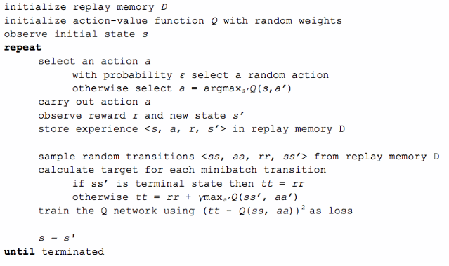

# Deep reinforcment Q-Learning for TRON

**Using deep reinforcement learning to train an AI to play TRON!**

*You can see the result below:*


*Here are two AIs playing against each other: this is after a 300 000 games training for the AIsurvivor.*

*With a basic reward policy for the q-learning algorithm they still make a lot of mistakes, but we start to see some strategy appears: there is a game where the red player does a bad start by going down in a dead end... Realizing that, he tries to go up but the blue player chooses to block him afterwards!*

## Required python librairies

To run this project, you need the following python librairies:

* [Pygame](https://www.pygame.org): used for the game engine.
* [Pytorch](https://pytorch.org): used for CNN and Q-learning manipulations part.

## Play the game

To play one game, run the *play.py* script.


### Players configuration

To choose which players will compete, edit the *play.py* script.

import from the respective folders the AIs you want to see play.

```
from ais.basic.ai import Ai as AiBasic
from ais.survivor.ai import Ai as Aisurvivor
```

Then when creating the game, add your each of your AIs as a *PositionPlayer*.

```
game = Game(width, height, [
    PositionPlayer(1, AiBasic(), [x1,y1]),
    PositionPlayer(2, Aisurvivor(), [x2,y2]),
])
```
    
Two simple IAs are available for the moment:
* **AiBasic**: rewarded in winning situations, punished in losing ones.
* **Aisurvivor**: rewarded at each turn where it doesn't die, or in winning situations.

If you want to play yourself the game, add a *KeyboardPlayer* instead.
you can specify the initial direction, as well as a mode for assigning the control keys:

`KeyboardPlayer(Direction.UP, Mode.ARROWS)` for instance.

## IA Training

I went through [this article](https://www.intel.ai/demystifying-deep-reinforcement-learning) as well as pytorch tutorials to implement the Deep Q-learning algorithm.



To start the training, run the *trainAI.py* script.

Each parameter of the Q learning algorithm (Exploration epsilon factor, memory capacity, length of games cycle...) can be tweaked in the script.

In order to accelerate the training, an experience memory has been added: we make our AI play several games before analyzing them. The history of each game is then decomposed and saved as Transitions.

We pass as an input of our CNN the game map converted to an array: 0 for empty space, -1 for a wall, 10 for the player head and -10 for the enemy's head.

To see actually see the training in the game, you can choose to pass a *Window* for the game loop.

```
# Run the game
window = Window(game, 40)
game.main_loop(window)
#game.main_loop() without window for faster training with no visual
```

### Selecting the AI you want to train

I created two folders for the different IAs I trained.
Precise for the `folderName` variable the folder name of the IA yout want to train.

```
# General parameters
folderName = 'survivor'
```

The weights for your IA's CNN will then be saved in an **ia.bak** file.

### Tweaking the reward policy

You can edit the IA reward policy directly in the *train.py* script.
Here is an example for the Aisurvivor reward policy:

```
# Compute the reward for each player
reward_p1 = -1
reward_p2 = -1
if historyStep +1 == len(game.history)-1:
    if game.winner is None:
        null_games += 1
        reward_p1 = 0
        reward_p2 = 0
    elif game.winner == 1:
        reward_p1 += 100
        reward_p2 = 0
        p1_victories +=1
    else:
        reward_p1 = -25
        reward_p2 = 0
        p2_victories += 1
    terminal = True

reward_p1 = torch.from_numpy(np.array([reward_p1], dtype=np.float32)).unsqueeze(0)
reward_p2 = torch.from_numpy(np.array([reward_p2], dtype=np.float32)).unsqueeze(0)
```

## Bonus video

For fun I made an humoristic video in french trying to simply explain the deep reinforcment Q-learning technique used here to train the AIs.

*You can check this out with the image link below:*

[](https://www.youtube.com/watch?v=tcAYv7L2W_Q)
