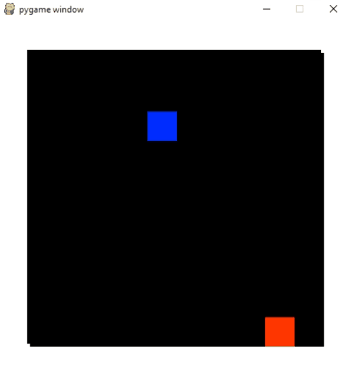
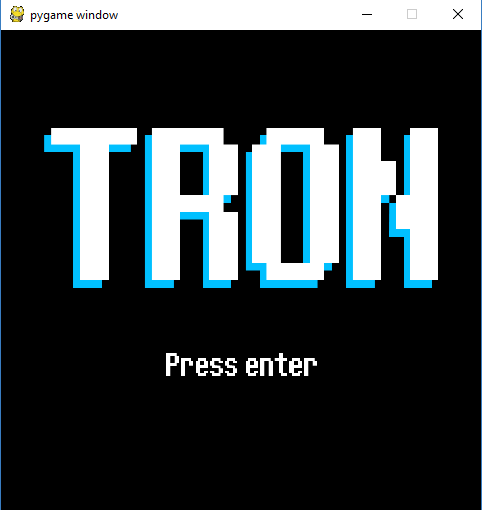

# Deep reinforcment Q-Learning for TRON

**Using deep reinforcement learning to train an AI to play TRON!**

*You can see the result below:*



*Here are two AIs playing against each other: this is after a 300 000 games training for the AIsurvivor.*

*With a basic reward policy for the q-learning algorithm they still make a lot of mistakes, but we start to see some strategy appears: there is a game where the red player does a bad start by going down in a dead end... Realizing that, he tries to go up but the blue player chooses to block him afterwards!*

## Required python librairies

To run this project, you need the following python librairies:

* [Pygame](https://www.pygame.org): used for the game engine.
* [Pytorch](https://pytorch.org): used for CNN and Q-learning manipulations part.

## Play the game

To play one game, run the *play.py* script.



### Players configuration

To choose which players will compete, edit the *play.py* script.

import from the respective folders the AIs you want to see play.

```
from ais.basic.ai import Ai as AiBasic
from ais.survivor.ai import Ai as Aisurvivor
```

Then when creating the game, add your each of your AIs as a *PositionPlayer*.

```
game = Game(width, height, [
    PositionPlayer(1, AiBasic(), [x1,y1]),
    PositionPlayer(2, Aisurvivor(), [x2,y2]),
])
```
    
Two simple IAs are available for the moment:
* **AiBasic**: rewarded in winning situations, punished in losing ones.
* **Aisurvivor**: rewarded at each turn where it doesn't die, or in winning situations.

If you want to play yourself the game, add a *KeyboardPlayer* instead.
you can specify the initial direction, as well as a mode for assigning the control keys:

`KeyboardPlayer(Direction.UP, Mode.ARROWS)` for instance.

## IA Training

I followed up [this article](https://www.intel.ai/demystifying-deep-reinforcement-learning) as well as pytorch tutorials to implement the Deep Q-learning algorithm.

## Bonus video

For fun I made an humoristic video in french trying to simply explain the deep reinforcment Q-learning technique used here to train the AIs.

*You can check this out with the image link below:*

[](https://www.youtube.com/watch?v=tcAYv7L2W_Q)
